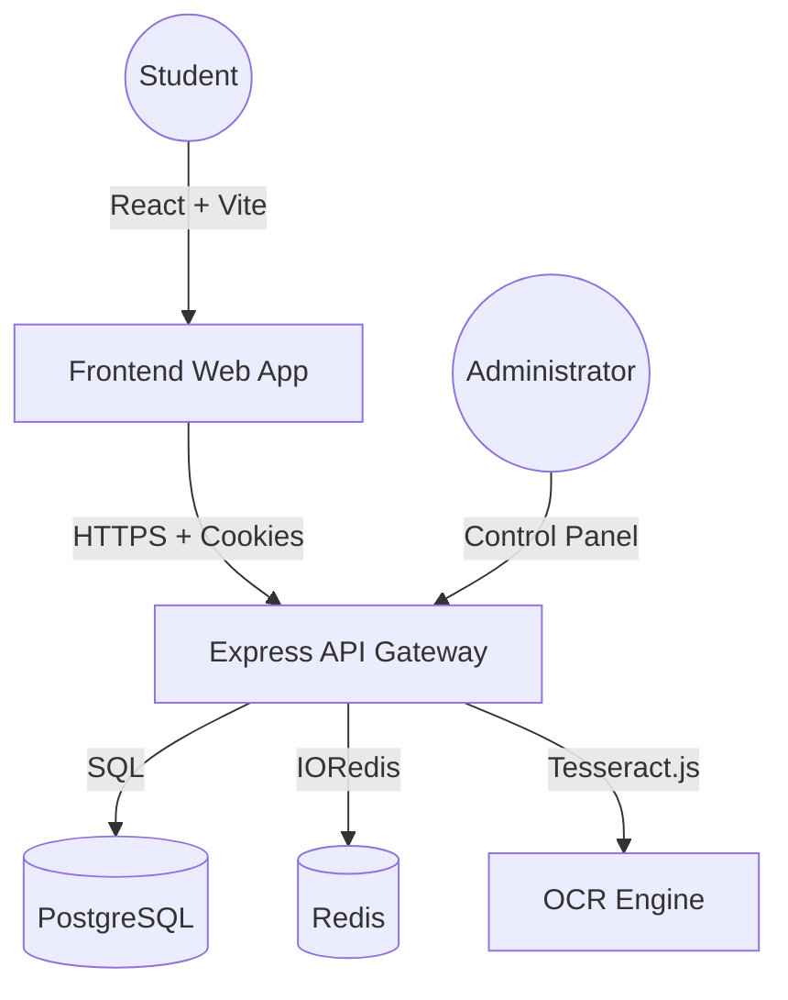

# ElimuPath 🎓

ElimuPath is an AI-powered platform designed to empower Kenyan students by providing personalized university course matches based on their KCSE results.


## 🚀 Overview

The transition from secondary school to university is a critical crossroad. ElimuPath simplifies this journey by:
1.  **AI Result Parsing**: Scan or upload your KCSE certificate.
2.  **Eligibility Matching**: Instant comparison against KUCCPS requirements.
3.  **Data-Driven Decisions**: Find courses where you meet both cluster and subject-specific thresholds.

## 🏗️ Architecture



## 🛠️ Tech Stack

- **Frontend**: React 19, Tailwind CSS 4, Framer Motion, Lucide Icons.
- **Backend**: Node.js, Express, JWT (httpOnly Cookies), Express Validator.
- **Data**: PostgreSQL (Persistence), Redis (Caching).
- **OCR**: Tesseract.js for certificate analysis.

## 🚦 Getting Started

### Local Development

1.  **Infrastructure**:
    ```bash
    docker compose up -d
    ```
2.  **Backend**:
    ```bash
    cd backend
    npm install
    npm run dev
    ```
3.  **Frontend**:
    ```bash
    cd frontend
    npm install
    npm run dev
    ```

### Seed Initial Data
To populate the database with sample Kenyan universities and courses:
```bash
cd backend
node src/scripts/seed.js
```

## 📦 Production Deployment

1.  **Build Frontend**:
    ```bash
    cd frontend
    npm run build
    ```
    *Build files will be generated in `frontend/dist`.*

2.  **Configure Environment**:
    Create a `.env` file in the `backend/` directory using the `.env.production.example` template.

3.  **Run with Node**:
    ```bash
    cd backend
    NODE_ENV=production npm start
    ```

## 🔒 Security Features

- **HTTP Security**: Helmet.js for secure headers.
- **Rate Limiting**: Protection against brute-force attacks on auth and upload endpoints.
- **Secure Auth**: JWT transmitted via `httpOnly` secure cookies.
- **Input Sanitization**: Strict schema validation for all user inputs.

---

&copy; 2026 ElimuPath - Shaping the Future of Kenyan Education.
